# Setup the development environment on your host computer

## 1. Create the development workspace on your host computer

1. Open a terminal and setup your workspace

> ```bash
> PC $> mkdir $HOME/STM32MPU_workspace
> PC $> cd $HOME/STM32MPU_workspace
> ```

2. Check host internet access

> ```bash
> PC $> wget -q www.google.com && echo "Internet access over HTTP/HTTPS is OK !" || echo "No internet access over HTTP/HTTPS ! You may need to set up a proxy."
> ```

​	==> Should provide you the following terminal output if your internet connection is ok

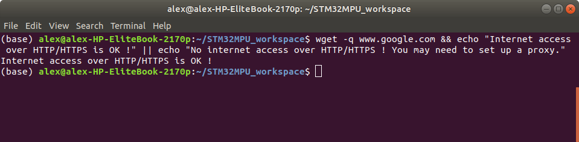

3. Allow internet over git://, ssh:// and others specifics protocols (skip this part if no proxy is used to access internet)

   In addition to http/https protocols (used in 90% of the Internet traffic), some other protocols like git:// or ssh:// may be required

   For example in the context of the *Distribution Package*, some "git fetch" commands could require "git:// protocols"

   In order to support these protocols through a proxy, the best way is to directly setup the proxy in the $HOME/.gitconfig file (core.gitproxy) and use a tool like *corkscrew* in order to tunnel the git:// flow into the http flow

> ```bash
> PC $> sudo apt-get update
> PC $> sudo apt-get install corkscrew
> 
> PC $> git config --replace-all --global core.gitproxy "$HOME/bin/git-proxy.sh"
> PC $> git config --add --global core.gitproxy "none for <MyPrivateNetworkDomain>" (optionnal and for example .st.com, localhost, ...)
> PC $> echo 'exec corkscrew <MyProxyServerUrl> <MyProxyPort> $* $HOME/.git-proxy.auth' > $HOME/bin/git-proxy.sh
> PC $> chmod 700 $HOME/bin/git-proxy.sh
> PC $> echo '<MyProxyLogin>:<MyProxyPassword>' > $HOME/.git-proxy.auth
> PC $> chmod 600 $HOME/.git-proxy.auth
> ```

​	Here is a command to test this proxy settings:

> ```bash
> PC $> git ls-remote git://git.openembedded.org/openembedded-core > /dev/null && echo OK || echo KO
> ```

​	==> This command should return *OK* else the proxy settings are wrong


------

## 2. Install STM32CubeProgrammer on your host computer

1. Install Java platform version 1.8 required by STM32CubeProgrammer

> ```bash
> PC $> sudo apt-get install openjdk-8-jre-headless
> PC $> sudo update-alternatives --config java
> ```

​	==> Select the java-8-openjdk configuration

2. Install OpenJFX for Ubuntu® 18.04

> ```bash
> PC $> sudo apt purge openjfx
> PC $> sudo apt install openjfx=8u161-b12-1ubuntu2 libopenjfx-jni=8u161-b12-1ubuntu2 libopenjfx-java=8u161-b12-1ubuntu2
> PC $> sudo apt-mark hold openjfx libopenjfx-jni libopenjfx-java
> ```

3. Create your STM32MPU tools directory

> ```bash
> PC $> mkdir -p $HOME/STM32MPU_workspace/STM32MPU_tools/STM32CubeProgrammer-2.5.0
> ```

4. Create a temporary directory in your STM32MPU workspace

> ```bash
> PC $> mkdir $HOME/STM32MPU_workspace/tmp
> ```

5. Download the latest [STM32CubeProgrammer][STM32CubeProgrammer download link] in `$HOME/STM32MPU_workspace/tmp`

[STM32CubeProgrammer download link]: https://www.st.com/en/development-tools/stm32cubeprog.html#getsoftware-scroll

​	*Note: If you got the STM32CubeProgrammer installation file from the USB dongle, please copy this installation file in `$HOME/STM32MPU_workspace/tmp`

6. Decompress the archive file to get the STM32CubeProgrammer installers

> ```bash
> PC $> cd $HOME/STM32MPU_workspace/tmp
> PC $> unzip en.stm32cubeprog_v2-5-0.zip
> ```

7. Execute the Linux installer which guides you through the installation process

> ```bash
> PC $> ./SetupSTM32CubeProgrammer-2.5.0.linux
> ```

​	==> Select $HOME/STM32MPU_workspace/STM32MPU_tools/STM32CubeProgrammer-2.5.0 as the installation directory

8. Add the STM32CubeProgrammer binary path to your PATH environment variable (or .bashrc)

> ```bash
> PC $> export PATH=$HOME/STM32MPU_workspace/STM32MPU_tools/STM32CubeProgrammer-2.5.0/bin:$PATH
> ```

9. Check that the STM32CubeProgrammer tool is properly installed and accessible

> ```bash
> PC $> STM32_Programmer_CLI –h
> ```

​	==> Should provide you the following terminal output

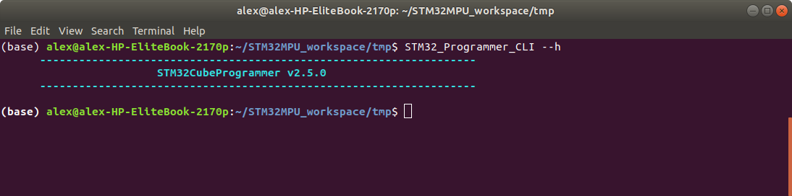


------

## 3. Install USB serial link on your host computer

1. Install the libusb

> ```bash
> PC $> sudo apt-get install libusb-1.0-0
> ```

2. Allow STM32CubeProgrammer to access to the USB port through low-level commands

> ```bash
> PC $> cd $HOME/STM32MPU_workspace/STM32MPU_tools/STM32CubeProgrammer-2.5.0/Drivers/rules
> PC $> sudo cp *.* /etc/udev/rules.d/
> ```


------

## 4. Install OpenSTLinux Developer Package SDK on your host computer

### 4.1 SDK installation

#### *This step is required to be able to build Linux kernel, device tree, modules, ... for STM32MP1 platform*

The SDK for OpenSTLinux distribution provides a stand-alone cross-development toolchain and libraries tailored to the contents of the specific image flashed in the board

1. In order to do basic development tasks or basic cross-compilation, some extra Ubuntu packages should be installed

> ```bash
> PC $> sudo apt-get update
> PC $> sudo apt-get install sed wget curl cvs subversion git-core coreutils unzip texi2html texinfo docbook-utils gawk python-pysqlite2 diffstat help2man make gcc build-essential g++ desktop-file-utils chrpath libxml2-utils xmlto docbook bsdmainutils iputils-ping cpio python-wand python-pycryptopp python-crypto
> PC $> sudo apt-get install libsdl1.2-dev xterm corkscrew nfs-common nfs-kernel-server device-tree-compiler mercurial u-boot-tools libarchive-zip-perl
> PC $> sudo apt-get install ncurses-dev bc linux-headers-generic gcc-multilib libncurses5-dev libncursesw5-dev lrzsz dos2unix lib32ncurses5 repo libssl-dev libyaml-dev
> PC $> sudo apt-get install pylint3 python3-git python3-jinja2 python-pip socat
> PC $> curl http://storage.googleapis.com/git-repo-downloads/repo > $HOME/bin/repo
> ```

2. By default, on Linux system, a maximum of 8 partitions are allowed on mmc. All STM32MP1 packages need more than 10 partitions for the storage device. In order to extend the number of partitions per device to 16, the following options must be added to modprobe

> ```bash
> PC $> echo 'options mmc_block perdev_minors=16' > /tmp/mmc_block.conf
> PC $> sudo mv /tmp/mmc_block.conf /etc/modprobe.d/mmc_block.conf
> ```

3. Download the latest [Developer Package SDK][SDK download link] in `$HOME/STM32MPU_workspace/tmp`

[SDK download link]: https://www.st.com/en/embedded-software/stm32mp1dev.html

4. Go to `$HOME/STM32MPU_workspace/tmp` directory and decompress the tarball file to get the SDK installation script

> ```bash
> PC $> cd $HOME/STM32MPU_workspace/tmp
> PC $> tar xvf en.SDK-x86_64-stm32mp1-openstlinux-5-4-dunfell-mp1-20-11-12.tar.xz
> ```

5. Create your STM32MP15x Developer Package SDK directory

> ```bash
> PC $> mkdir -p $HOME/STM32MPU_workspace/STM32MP15-Ecosystem-v2.0.0/Developer-Package/SDK
> ```

6. Change the permissions of the SDK installation script so that it is executable

> ```bash
> PC $> chmod +x stm32mp1-openstlinux-5-4-dunfell-mp1-20-11-12/sdk/st-image-weston-openstlinux-weston-stm32mp1-x86_64-toolchain-3.1-openstlinux-5-4-dunfell-mp1-20-11-12.sh
> ```

7. Execute the SDK installation script

> ```bash
> PC $> ./stm32mp1-openstlinux-5-4-dunfell-mp1-20-11-12/sdk/st-image-weston-openstlinux-weston-stm32mp1-x86_64-toolchain-3.1-openstlinux-5-4-dunfell-mp1-20-11-12.sh -d $HOME/STM32MPU_workspace/STM32MP15-Ecosystem-v2.0.0/Developer-Package/SDK
> ```

​	==> A successful installation outputs the following log

> ```bash
> ST OpenSTLinux - Weston - (A Yocto Project Based Distro) SDK installer version 3.1-openstlinux-5-4-dunfell-mp1-20-11-12
> =======================================================================================================================
> You are about to install the SDK to "/home/osboxes/MCD/V2.0/Developper-Package/SDK". Proceed [Y/n]? Y
> Extracting SDK................................................................................................................................................................................................................done
> Setting it up...done
> SDK has been successfully set up and is ready to be used.
> Each time you wish to use the SDK in a new shell session, you need to source the environment setup script e.g.
> $ . $HOME/STM32MPU_workspace/STM32MP15-Ecosystem-v2.0.0/Developer-Package/SDK/environment-setup-cortexa7t2hf-neon-vfpv4-ostl-linux-gnueabi
> ```

### 4.2 Verification that the SDK is working well

1. The SDK environment setup script must be run once in each new working terminal in which you want to cross-compile

> ```bash
> PC $> cd $HOME/STM32MPU_workspace/STM32MP15-Ecosystem-v2.0.0/Developer-Package/SDK
> PC $> source environment-setup-cortexa7t2hf-neon-vfpv4-ostl-linux-gnueabi
> ```

2. The following checks allow to ensure that the environment is correctly setup

* Check the target architecture

> ```bash
> PC $> echo $ARCH
> arm
> ```

* Check the toolchain binary prefix for the target tools

> ```bash
> PC $> echo $CROSS_COMPILE
> arm-ostl-linux-gnueabi-
> ```

* Check the C compiler version

> ```bash
> PC $> $CC --version
> arm-ostl-linux-gnueabi-gcc (GCC) 9.3.0
> Copyright (C) 2019 Free Software Foundation, Inc.
> This is free software; see the source for copying conditions.  There is NO
> warranty; not even for MERCHANTABILITY or FITNESS FOR A PARTICULAR PURPOSE.
> ```

* Check that the SDK version is the expected one

> ```bash
> PC $> echo $OECORE_SDK_VERSION
> 3.1-openstlinux-5-4-dunfell-mp1-20-11-12
> ```

​	==> If any of these commands fails or does not return the expected result, please try to reinstall the SDK

​	==> The SDK is in the `$HOME/STM32MPU_workspace/STM32MP15-Ecosystem-v2.0.0/Developer-Package/SDK` directory

> ```text
> <SDK installation directory>                                      SDK for OpenSTLinux distribution: details in Standard SDK directory structure article
> ├── environment-setup-cortexa7t2hf-neon-vfpv4-ostl-linux-gnueabi  Environment setup script for Developer Package
> ├── site-config-cortexa7t2hf-neon-vfpv4-ostl-linux-gnueabi
> ├── sysroots
> │   ├── cortexa7t2hf-neon-vfpv4-ostl-linux-gnueabi                Target sysroot (libraries, headers, and symbols)
> │   │   └── [...]
> │   └── x86_64-ostl_sdk-linux                                     Native sysroot (libraries, headers, and symbols)
> │       └── [...]
> └── version-cortexa7t2hf-neon-vfpv4-ostl-linux-gnueabi
> ```


------

## 5. Install OpenSTLinux Developer Package on your host computer

#### *This step is required to download the all the source code needed to build up the system*

1. Download the latest [STM32MP1 OpenSTLinux Developer Package][Developer Package download link] in `$HOME/STM32MPU_workspace/STM32MP15-Ecosystem-v2.0.0/Developer-Package`

[Developer Package download link]: https://www.st.com/en/embedded-software/stm32mp1dev.html

* *This package includes the following pieces of software in source code*
  * *Linux® kernel*
  * *U-Boot*
  * *Trusted firmware-A (TF-A)*
  * *An optional open source trusted execution environment (OP-TEE)*

2. Go to `$HOME/STM32MPU_workspace/STM32MP15-Ecosystem-v2.0.0/Developer-Package` directory

> ```bash
> PC $> cd $HOME/STM32MPU_workspace/STM32MP15-Ecosystem-v2.0.0/Developer-Package
> ```

3. Decompress the tarball file to get the Linux kernel (Linux kernel source code, ST patches, ST configuration fragments, ...)

> ```bash
> PC $> tar xvf en.SOURCES-stm32mp1-openstlinux-5-4-dunfell-mp1-20-11-12.tar.xz
> PC $> cd stm32mp1-openstlinux-5-4-dunfell-mp1-20-11-12/sources/arm-ostl-linux-gnueabi/linux-stm32mp-5.4.56-r0
> PC $> tar xvf linux-5.4.56.tar.xz
> PC $> cd linux-5.4.56 
> ```

​	==> The *Linux kernel installation directory* is in the `$HOME/STM32MPU_workspace/STM32MP15-Ecosystem-v2.0.0/Developer-Package/stm32mp1-openstlinux-20-06-24/sources/arm-ostl-linux-gnueabi` directory, and is named *linux-stm32mp-5.4.56-r0*

> ```text
> linux-stm32mp-5.4.56-r0     Linux kernel installation directory
> ├── [*].patch             ST patches to apply during the Linux kernel preparation (see next chapter)
> ├── fragment-[*].config   ST configuration fragments to apply during the Linux kernel configuration (see next chapter)
> ├── linux-5.4.56          Linux kernel source code directory
> ├── linux-5.4.56.tar.xz   Tarball file of the Linux kernel source code
> ├── README.HOW_TO.txt     Helper file for Linux kernel management: reference for Linux kernel build
> └── series                List of all ST patches to apply
> ```


------

# Create and program a complete package including Microsoft® Azure IoT Edge services

## 1. Using OpenSTLinux Distribution Package

The STM32MP1 OpenSTLinux distribution is delivered through a manifest repository location and a manifest revision (*openstlinux-5.4-dunfell-mp1-20-11-12*)

1. Create your STM32MP15x Distribution Package directory & sub-directory

> ```bash
> PC $> mkdir -p $HOME/STM32MPU_workspace/STM32MP15-Ecosystem-v2.0.0/Distribution-Package/openstlinux-5.4-dunfell-mp1-20-11-12
> ```

2. Go to `$HOME/STM32MPU_workspace/STM32MP15-Ecosystem-v2.0.0/Distribution-Package/openstlinux-5.4-dunfell-mp1-20-11-12` directory

> ```bash
> PC $> cd $HOME/STM32MPU_workspace/STM32MP15-Ecosystem-v2.0.0/Distribution-Package/openstlinux-5.4-dunfell-mp1-20-11-12
> ```

3. The installation relies on the repo command. First initialize repo in the current directory

> ```bash
> PC $> repo init -u https://github.com/STMicroelectronics/oe-manifest.git -b refs/tags/openstlinux-5.4-dunfell-mp1-20-11-12
> ```

4. Then synchronize the local project directories with the remote repositories specified in the manifest

> ```bash
> PC $> repo sync
> ```

​	==> Note: Distribution package needs around 140MB to be installed (and around 25GB once distribution package is compiled)

The OpenSTLinux distribution installation directory is in the `$HOME/STM32MPU_workspace/STM32MP15-Ecosystem-v2.0.0/Distribution-Package` directory and is named openstlinux-5.4-dunfell-mp1-20-11-12

> ```
> openstlinux-5.4-dunfell-mp1-20-11-12  OpenSTLinux distribution
> ├── layers 
> │    ├── meta-openembedded                Collection of layers for the OpenEmbedded-Core universe (OpenEmbedded standard)
> │    ├── meta-qt5                         QT5 layer for OpenEmbedded (standard)
> │    ├── meta-st
> │    │   ├── meta-st-openstlinux          STMicroelectronics layer that contains the frameworks and images settings for the OpenSTLinux distribution
> │    │   ├── meta-st-stm32mp              STMicroelectronics layer that contains the description of the BSP for the STM32 MPU devices
> │    │   │   ├── recipes-bsp
> │    │   │   │   ├── alsa                 Recipes for ALSA control configuration
> │    │   │   │   ├── drivers              Recipes for Vivante GCNANO GPU kernel drivers
> │    │   │   │   ├── trusted-firmware-a   Recipes for TF-A
> │    │   │   │   └── u-boot               Recipes for U-Boot
> │    │   │   ├── recipes-extended
> │    │   │   │   ├── linux-examples       Recipes for Linux examples for STM32 MPU devices
> │    │   │   │   ├── m4coredump           Recipes for script to manage coredump of cortexM4
> │    │   │   │   └── m4projects           Recipes for firmware examples for Cortex M4
> │    │   │   ├── recipes-graphics
> │    │   │   │   ├── gcnano-userland      Recipes for Vivante libraries OpenGL ES, OpenVG and EGL (multi backend)
> │    │   │   │   └── [...]
> │    │   │   ├── recipes-kernel
> │    │   │   │   ├── linux                Recipes for Linux kernel
> │    │   │   │   └── linux-firmware       Recipes for Linux firmwares (example, Bluetooth firmware)
> │    │   │   ├── recipes-security
> │    │   │   │   └── optee                Recipes for OPTEE
> │    │   │   ├── recipes-st
> │    │   │   │   └── images               Recipes for the bootfs and userfs partitions binaries
> │    │   │   └── [...]
> │    │   ├── meta-st-stm32mp-addons       STMicroelectronics layer that helps managing the STM32CubeMX integration
> │    │   └── scripts
> │    │       ├── envsetup.sh              Environment setup script for Distribution Package
> │    │       └── [...]
> │    ├── meta-timesys                     Timesys layer for OpenEmbedded (standard)
> │    └── openembedded-core                Core metadata for current versions of OpenEmbedded (standard)
> ```

5. Get meta-iotedge and the dependencies

> ```bash
> PC $> cd  $HOME/STM32MPU_workspace/STM32MP15-Ecosystem-v2.0.0/Distribution-Package/openstlinux-5.4-dunfell-mp1-20-11-12/layers/
> PC $> git clone -b dunfell https://github.com/Azure/meta-iotedge.git
> PC $> git clone git://github.com/meta-rust/meta-rust.git
> PC $> git clone -b dunfell git://git.yoctoproject.org/meta-virtualization
> PC $> cd meta-rust
> PC $> git checkout e4d25b98083bcecb94df6ee189a165d63ede7f3d -b INT_AZURE
> ```

### 1.1 Initializing the OpenEmbedded build environment

==> The OpenEmbedded environment setup script must be run once in each new working terminal in which you use the BitBake or devtool tools

> ```bash
> PC $> cd $HOME/STM32MPU_workspace/STM32MP15-Ecosystem-v2.0.0/Distribution-Package/openstlinux-5.4-dunfell-mp1-20-11-12
> PC $> DISTRO=openstlinux-weston MACHINE=stm32mp1 source layers/meta-st/scripts/envsetup.sh
> ```

The BSP for STM32MP1 depends on packages and firmware which are covered by a **[software license agreement (SLA)](https://wiki.st.com/stm32mpu/wiki/OpenSTLinux_licenses#Top_Software_license_agreement_.28SLA.29_and_third-party_licences)**. You will be asked to read and to accept this EULA

Note that:

- *openstlinux-weston* (OpenSTLinux distribution featuring Weston/Wayland) and *stm32mp1* (machine configuration for all STM32MP1 hardware configurations) are the **default** values for *DISTRO* and *MACHINE*
- The software packages for the Starter Package (image) and for the Developer Package (SDK...) have been built with this configuration
- Other values for *DISTRO* and *MACHINE* are proposed in OpenSTLinux distribution

Among other things, the environment setup script creates the **build directory** named **build-openstlinuxweston-stm32mp1**. After the script runs, the current working directory is set to this build directory. When the build completes, it contains all the files created during the build

The local configuration file (*build-openstlinuxweston-stm32mp1/conf/local.conf*) contains all local user settings. The layers configuration file (*build-openstlinuxweston-stm32mp1/conf/bblayers.conf*) tells BitBake which layers must be considered during the build

> ```
> openstlinux-5.4-dunfell-mp1-20-11-12	OpenSTLinux distribution
> ├── build-openstlinuxweston-stm32mp1	Build directory
> │   ├── conf
> │   │   ├── bblayers.conf				Local configuration file
> │   │   ├── local.conf					Layers configuration file
> │   │   └── [...]
> │   └── workspace
> ├── layers
> │   ├── meta-openembedded
> │   ├── [...]
> ```

### 1.2 Include Microsoft® Azure IoT Edge

1. Add the meta-iotedge layer and other dependencies yocto layers to the distribution configuration

> ```bash
> PC $> cd $HOME/STM32MPU_workspace/STM32MP15-Ecosystem-v2.0.0/Distribution-Package/openstlinux-5.4-dunfell-mp1-20-11-12/build-openstlinuxweston-stm32mp1
> PC $> bitbake-layers add-layer $HOME/STM32MPU_workspace/STM32MP15-Ecosystem-v2.0.0/Distribution-Package/openstlinux-5.4-dunfell-mp1-20-11-12/layers/meta-rust/
> PC $> bitbake-layers add-layer $HOME/STM32MPU_workspace/STM32MP15-Ecosystem-v2.0.0/Distribution-Package/openstlinux-5.4-dunfell-mp1-20-11-12/layers/meta-virtualization/
> PC $> bitbake-layers add-layer $HOME/STM32MPU_workspace/STM32MP15-Ecosystem-v2.0.0/Distribution-Package/openstlinux-5.4-dunfell-mp1-20-11-12/layers/meta-iotedge/
> ```

2. Update the configuration to add the new components in your image

   - Add `DISTRO_FEATURES_append = "virtualization"` in `$HOME/STM32MPU_workspace/STM32MP15-Ecosystem-v2.0.0/Distribution-Package/openstlinux-5.4-dunfell-mp1-20-11-12/layers/meta-st/meta-st-openstlinux/conf/distro/openstlinux-weston.conf` file

   - Add `IMAGE_INSTALL_append += "iotedge-cli libiothsm-std docker connman connman-client"` in `$HOME/STM32MPU_workspace/STM32MP15-Ecosystem-v2.0.0/Distribution-Package/openstlinux-5.4-dunfell-mp1-20-11-12/build-openstlinuxweston-stm32mp1/conf/local.conf` file
   - Change `ROOTFS_PARTITION_SIZE = "763904"` to `ROOTFS_PARTITION_SIZE = "2097152"` in `$HOME/STM32MPU_workspace/STM32MP15-Ecosystem-v2.0.0/Distribution-Package/openstlinux-5.4-dunfell-mp1-20-11-12/layers/meta-st/meta-st-stm32mp/conf/machine/include/st-machine-common-stm32mp.inc` file
   - Add `CONFIG_EXT4_FS_SECURITY=y` in `$HOME/STM32MPU_workspace/STM32MP15-Ecosystem-v2.0.0/Distribution-Package/openstlinux-5.4-dunfell-mp1-20-11-12/layers/meta-st/meta-st-stm32mp/recipes-kernel/linux/linux-stm32mp/5.4/fragment-03-systemd.config` file

3. Build the image

   To build the image, execute the following command in the folder `$HOME/STM32MPU_workspace/STM32MP15-Ecosystem-v2.0.0/Distribution-Package/openstlinux-5.4-dunfell-mp1-20-11-12/build-openstlinuxweston-stm32mp1`

> ```bash
> PC $> bitbake st-image-weston
> ```


------

## 2. Program the SDCard with the built package

1. Set the boot switches (located at the back of the board) to the off position

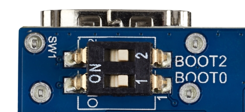

2. Connect an USB Type A to Type C cable between your PC and CN7 (USB) connector (SDCard programming port)
3. Connect an USB Type A to Type C cable between your PC and CN6 (PWR_IN) connector (board power supply)
4. Press the reset button to reset the board
5. Launch STM32CubeProgrammer to get the GUI

> ```bash
> PC $> STM32CubeProgrammer
> ```

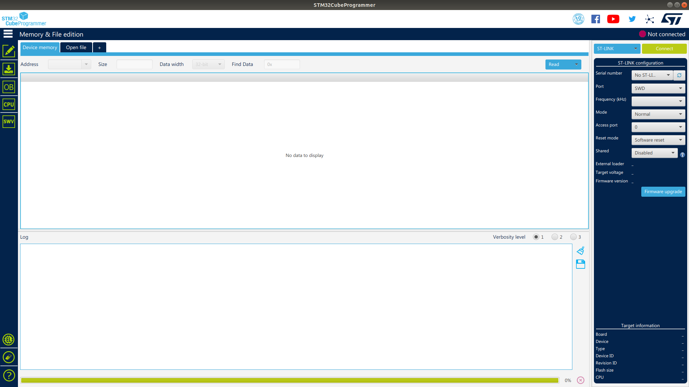

6. On the right, select USB (not STLINK, set by default) in the connection picklist and click on *Refresh* button. Serial Number is displayed if USB is detected. Click on *Connect*

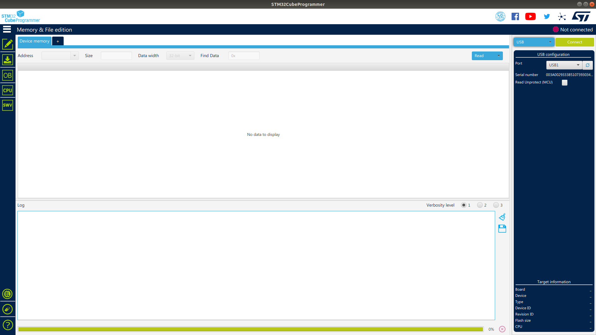


7. Select *Open File* tab and select the *FlashLayout_sdcard_stm32mp157a-dk1-trusted.tsv* file in `$HOME/STM32MPU_workspace/STM32MP15-Ecosystem-v2.5.0/Distribution-Package/openstlinux-5.4-dunfell-mp1-20-11-12/build-openstlinuxweston-stm32mp1/tmp-glibc/deploy/images/stm32mp1/flashlayout_st-image-weston/trusted` installation folder

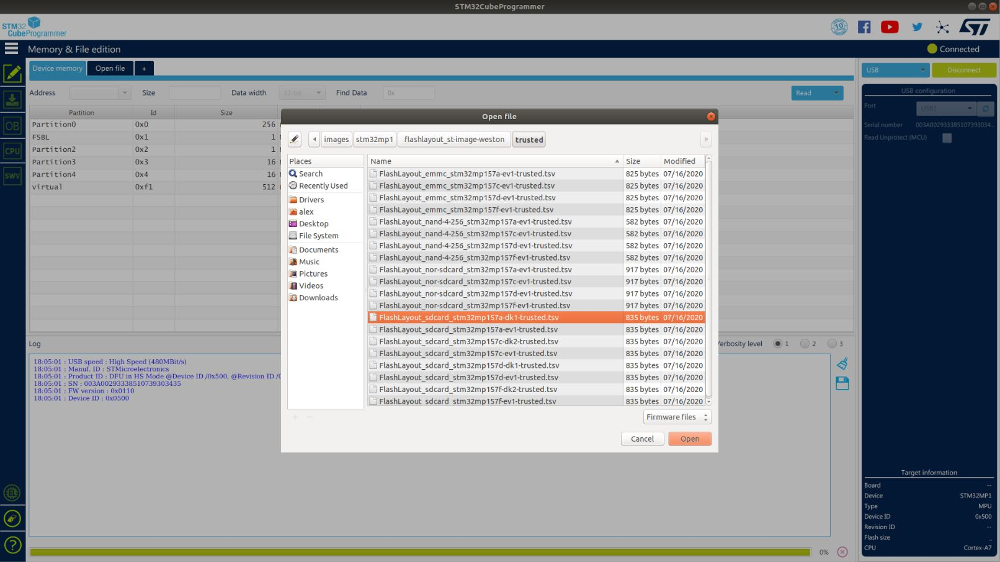

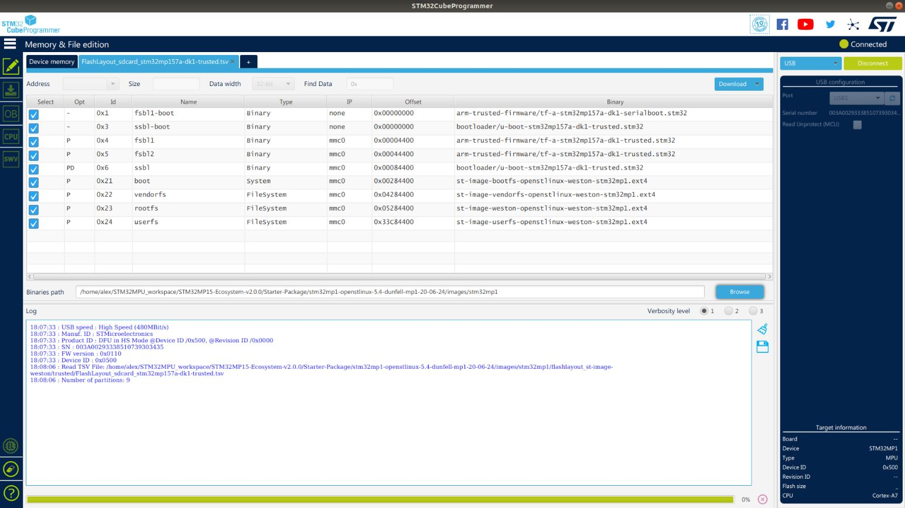

8. Fill the *Binaries Path* by browsing up to folder `$HOME/STM32MPU_workspace/STM32MP15-Ecosystem-v2.5.0/Distribution-Package/openstlinux-5.4-dunfell-mp1-20-11-12/build-openstlinuxweston-stm32mp1/tmp-glibc/deploy/images/stm32mp1`

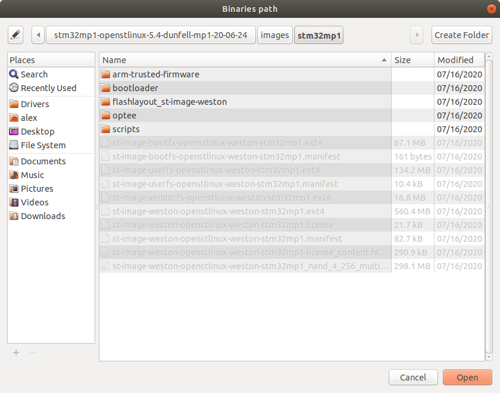

9. Click on *Download* to start the flashing process

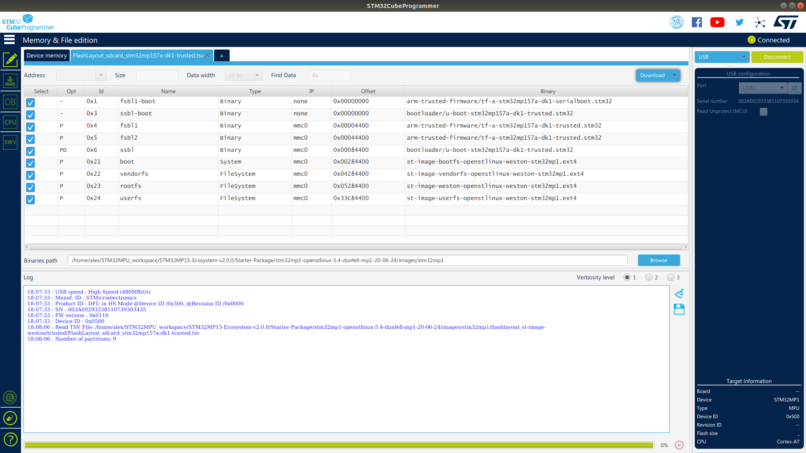

10. Progress is displayed with progress bar till completion popup message

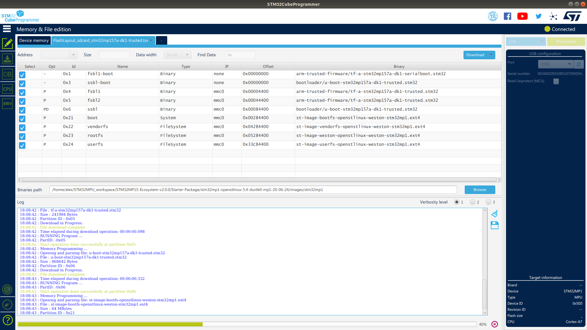

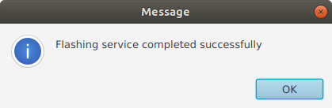

11. Disconnect the USB Type A to Type C cable between your PC and CN7 (USB) connector (SDCard programming port)
12. Disconnect the USB Type A to Type C cable between your PC and CN6 (PWR_IN) connector (board power supply)
13. Set the boot switches (located at the back of the board) to the ON position

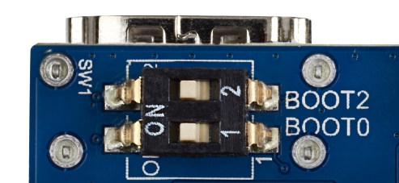


------

## 3. Install a serial terminal on your host computer

The serial terminal allows to communicate with the board trough a UART serial interface

1. Connect an USB Type A to micro USB Type B cable between your PC and CN11 (ST-LINK) connector (debug port)
2. Connect an USB Type A to Type C cable between your PC and CN6 (PWR_IN) connector (board power supply)
3. Install minicom

> ```bash
> PC $> sudo apt-get install minicom
> ```

4. Get the ttyACM device instance that need to be used to access the ST-LINK/V2-1

> ```bash
> PC $> ls /dev/ttyACM*
> /dev/ttyACM0
> ```

5. Connect the minicom to the /dev/ttyACM0 device

> ```bash
> PC $> minicom -D /dev/ttyACM0
> Welcome to minicom 2.7
> 
> OPTIONS: I18n 
> Compiled on Nov 15 2018, 20:18:47.
> Port /dev/ttyACM0, 15:56:03
> 
> Press CTRL-A Z for help on special keys
> ```

6. Press the reset button to reset the board. You should see boot log displayed in the minicom window

> ```bash
> NOTICE:  CPU: STM32MP157AAC Rev.B
> NOTICE:  Model: STMicroelectronics STM32MP157A-DK1 Discovery Board
> NOTICE:  Board: MB1272 Var1.0 Rev.C-01
> INFO:    Reset reason (0x15):
> INFO:      Power-on Reset (rst_por)
> INFO:    PMIC version = 0x10
> INFO:    Using SDMMC
> INFO:      Instance 1
> INFO:    Boot used partition fsbl1
> NOTICE:  BL2: v2.2-r1.0(debug):v2.2-dirty
> NOTICE:  BL2: Built : 13:36:23, Oct 22 2019
> INFO:    Using crypto library 'stm32_crypto_lib'
> INFO:    BL2: Doing platform setup
> INFO:    RAM: DDR3-DDR3L 16bits 533000Khz
> INFO:    Memory size = 0x20000000 (512 MB)
> INFO:    BL2 runs SP_MIN setup
> INFO:    BL2: Loading image id 4
> INFO:    Loading image id=4 at address 0x2ffed000
> INFO:    Image id=4 loaded: 0x2ffed000 - 0x2ffff000
> INFO:    BL2: Loading image id 5
> INFO:    Loading image id=5 at address 0xc0100000
> INFO:    STM32 Image size : 868386
> INFO:    Image id=5 loaded: 0xc0100000 - 0xc01d4022
> WARNING: Skip signature check (header option)
> NOTICE:  ROTPK is not deployed on platform. Skipping ROTPK verification.
> NOTICE:  BL2: Booting BL32
> INFO:    Entry point address = 0x2ffed000
> INFO:    SPSR = 0x1d3
> NOTICE:  SP_MIN: v2.2-r1.0(debug):v2.2-dirty
> NOTICE:  SP_MIN: Built : 13:36:23, Oct 22 2019
> INFO:    ARM GICv2 driver initialized
> INFO:    stm32mp IWDG1 (12): Secure
> INFO:    ETZPC: CRYP1 (9) could be non secure
> INFO:    SP_MIN: Initializing runtime services
> INFO:    SP_MIN: Preparing exit to normal world
> 
> 
> U-Boot 2020.01-stm32mp-r1 (Jan 06 2020 - 20:56:31 +0000)
> 
> CPU: STM32MP157AAC Rev.B
> Model: STMicroelectronics STM32MP157A-DK1 Discovery Board
> Board: stm32mp1 in trusted mode (st,stm32mp157a-dk1)
> Board: MB1272 Var1.0 Rev.C-01
> DRAM:  512 MiB
> Clocks:
> - MPU : 650 MHz
> - MCU : 208.878 MHz
> - AXI : 266.500 MHz
> - PER : 24 MHz
> - DDR : 533 MHz
> WDT:   Started with servicing (32s timeout)
> NAND:  0 MiB
> MMC:   STM32 SD/MMC: 0
> Loading Environment from MMC... OK
> In:    serial
> Out:   serial
> Err:   serial
> Net:   eth0: ethernet@5800a000
> Hit any key to stop autoboot:  0
> Boot over mmc0!
> switch to partitions #0, OK
> mmc0 is current device
> Scanning mmc 0:4...
> Found /mmc0_extlinux/extlinux.conf
> Retrieving file: /mmc0_extlinux/extlinux.conf
> 256 bytes read in 38 ms (5.9 KiB/s)
> Retrieving file: /splash.bmp
> 18244 bytes read in 39 ms (456.1 KiB/s)
> 1:      OpenSTLinux
> Retrieving file: /uInitrd
> 3632453 bytes read in 192 ms (18 MiB/s)
> Retrieving file: /uImage
> 7309840 bytes read in 348 ms (20 MiB/s)
> append: root=PARTUUID=e91c4e10-16e6-4c0e-bd0e-77becf4a3582 rootwait rw console=ttySTM0,115200
> Retrieving file: /stm32mp157a-dk1.dtb
> 70596 bytes read in 41 ms (1.6 MiB/s)
> ## Booting kernel from Legacy Image at c2000000 ...
>    Image Name:   Linux-5.4.31
>    Created:      2020-04-08   7:08:47 UTC
>    Image Type:   ARM Linux Kernel Image (uncompressed)
>    Data Size:    7309776 Bytes = 7 MiB
>    Load Address: c2000040
>    Entry Point:  c2000040
>    Verifying Checksum ... OK
> ## Flattened Device Tree blob at c4000000
>    Booting using the fdt blob at 0xc4000000
>    XIP Kernel Image
>    Loading Ramdisk to cfc89000, end cffffd45 ... OK
>    Loading Device Tree to cfc74000, end cfc883c3 ... OK
> 
> Starting kernel ...
> 
> [    0.000000] Booting Linux on physical CPU 0x0
> [    0.000000] Linux version 5.4.31 (oe-user@oe-host) (gcc version 9.3.0 (GCC)) #1 SMP PREEMPT Wed Apr 8 07:08:47 UTC 2020
> [    0.000000] CPU: ARMv7 Processor [410fc075] revision 5 (ARMv7), cr=10c5387d
> [    0.000000] CPU: div instructions available: patching division code
> [    0.000000] CPU: PIPT / VIPT nonaliasing data cache, VIPT aliasing instruction cache
> [    0.000000] OF: fdt: Machine model: STMicroelectronics STM32MP157A-DK1 Discovery Board
> [    0.000000] Memory policy: Data cache writealloc
> [    0.000000] Reserved memory: created DMA memory pool at 0x10000000, size 0 MiB
> [    0.000000] OF: reserved mem: initialized node mcuram2@10000000, compatible id shared-dma-pool
> [    0.000000] Reserved memory: created DMA memory pool at 0x10040000, size 0 MiB
> [    0.000000] OF: reserved mem: initialized node vdev0vring0@10040000, compatible id shared-dma-pool
> [    0.000000] Reserved memory: created DMA memory pool at 0x10041000, size 0 MiB
> [    0.000000] OF: reserved mem: initialized node vdev0vring1@10041000, compatible id shared-dma-pool
> [    0.000000] Reserved memory: created DMA memory pool at 0x10042000, size 0 MiB
> [    0.000000] OF: reserved mem: initialized node vdev0buffer@10042000, compatible id shared-dma-pool
> [    0.000000] Reserved memory: created DMA memory pool at 0x30000000, size 0 MiB
> [    0.000000] OF: reserved mem: initialized node mcuram@30000000, compatible id shared-dma-pool
> [    0.000000] Reserved memory: created DMA memory pool at 0x38000000, size 0 MiB
> [    0.000000] OF: reserved mem: initialized node retram@38000000, compatible id shared-dma-pool
> [    0.000000] cma: Reserved 128 MiB at 0xd2000000
> [    0.000000] psci: probing for conduit method from DT.
> [    0.000000] psci: PSCIv1.1 detected in firmware.
> [    0.000000] psci: Using standard PSCI v0.2 function IDs
> [    0.000000] psci: MIGRATE_INFO_TYPE not supported.
> [    0.000000] psci: SMC Calling Convention v1.0
> [    0.000000] percpu: Embedded 20 pages/cpu s50124 r8192 d23604 u81920
> [    0.000000] Built 1 zonelists, mobility grouping on.  Total pages: 113536
> [    0.000000] Kernel command line: root=PARTUUID=e91c4e10-16e6-4c0e-bd0e-77becf4a3582 rootwait rw console=ttySTM0,115200
> [    0.000000] Dentry cache hash table entries: 65536 (order: 6, 262144 bytes, linear)
> [    0.000000] Inode-cache hash table entries: 32768 (order: 5, 131072 bytes, linear)
> [    0.000000] mem auto-init: stack:off, heap alloc:off, heap free:off
> [    0.000000] Memory: 301484K/458752K available (11264K kernel code, 868K rwdata, 3408K rodata, 1024K init, 213K bss, 26196K reserved, 131072K cma-reserved, 0K highmem)
> [    0.000000] SLUB: HWalign=64, Order=0-3, MinObjects=0, CPUs=2, Nodes=1
> [    0.000000] rcu: Preemptible hierarchical RCU implementation.
> [    0.000000] rcu:     RCU event tracing is enabled.
> [    0.000000]  Tasks RCU enabled.
> [    0.000000] rcu: RCU calculated value of scheduler-enlistment delay is 10 jiffies.
> [    0.000000] NR_IRQS: 16, nr_irqs: 16, preallocated irqs: 16
> [    0.000000] random: get_random_bytes called from start_kernel+0x31c/0x4f4 with crng_init=0
> [    0.000000] arch_timer: cp15 timer(s) running at 24.00MHz (virt).
> [    0.000000] clocksource: arch_sys_counter: mask: 0xffffffffffffff max_cycles: 0x588fe9dc0, max_idle_ns: 440795202592 ns
> [    0.000009] sched_clock: 56 bits at 24MHz, resolution 41ns, wraps every 4398046511097ns
> [    0.000028] Switching to timer-based delay loop, resolution 41ns
> [    0.001762] Console: colour dummy device 80x30
> [    0.001813] Calibrating delay loop (skipped), value calculated using timer frequency.. 48.00 BogoMIPS (lpj=240000)
> [    0.001835] pid_max: default: 32768 minimum: 301
> [    0.002096] Mount-cache hash table entries: 1024 (order: 0, 4096 bytes, linear)
> [    0.002117] Mountpoint-cache hash table entries: 1024 (order: 0, 4096 bytes, linear)
> [    0.003442] CPU: Testing write buffer coherency: ok
> [    0.003983] /cpus/cpu@0 missing clock-frequency property
> [    0.004016] /cpus/cpu@1 missing clock-frequency property
> [    0.004035] CPU0: thread -1, cpu 0, socket 0, mpidr 80000000
> [    0.059840] Setting up static identity map for 0xc0100000 - 0xc0100060
> [    0.079813] rcu: Hierarchical SRCU implementation.
> [    0.104284] smp: Bringing up secondary CPUs ...
> [    0.180464] CPU1: thread -1, cpu 1, socket 0, mpidr 80000001
> [    0.180687] smp: Brought up 1 node, 2 CPUs
> [    0.180712] SMP: Total of 2 processors activated (96.00 BogoMIPS).
> [    0.180722] CPU: All CPU(s) started in SVC mode.
> [    0.181584] devtmpfs: initialized
> [    0.208260] VFP support v0.3: implementor 41 architecture 2 part 30 variant 7 rev 5
> [    0.208898] clocksource: jiffies: mask: 0xffffffff max_cycles: 0xffffffff, max_idle_ns: 19112604462750000 ns
> [    0.208934] futex hash table entries: 512 (order: 3, 32768 bytes, linear)
> [    0.216058] pinctrl core: initialized pinctrl subsystem
> [    0.218402] NET: Registered protocol family 16
> [    0.223169] DMA: preallocated 256 KiB pool for atomic coherent allocations
> [    0.225704] hw-breakpoint: found 5 (+1 reserved) breakpoint and 4 watchpoint registers.
> [    0.225724] hw-breakpoint: maximum watchpoint size is 8 bytes.
> [    0.226156] Serial: AMBA PL011 UART driver
> [    0.229316] stm32-pm-domain pm_domain: domain core-ret-power-domain registered
> [    0.229356] stm32-pm-domain pm_domain: subdomain core-power-domain registered
> [    0.229373] stm32-pm-domain pm_domain: domains probed
> [    0.273460] SCSI subsystem initialized
> [    0.281289] usbcore: registered new interface driver usbfs
> [    0.281377] usbcore: registered new interface driver hub
> [    0.281524] usbcore: registered new device driver usb
> [    0.281915] pps_core: LinuxPPS API ver. 1 registered
> [    0.281930] pps_core: Software ver. 5.3.6 - Copyright 2005-2007 Rodolfo Giometti <giometti@linux.it>
> [    0.281971] PTP clock support registered
> [    0.282271] EDAC MC: Ver: 3.0.0
> [    0.283676] Advanced Linux Sound Architecture Driver Initialized.
> [    0.285478] clocksource: Switched to clocksource arch_sys_counter
> [    1.010613] thermal_sys: Registered thermal governor 'step_wise'
> [    1.011236] NET: Registered protocol family 2
> [    1.012374] tcp_listen_portaddr_hash hash table entries: 512 (order: 0, 6144 bytes, linear)
> [    1.012428] TCP established hash table entries: 4096 (order: 2, 16384 bytes, linear)
> [    1.012496] TCP bind hash table entries: 4096 (order: 3, 32768 bytes, linear)
> [    1.012593] TCP: Hash tables configured (established 4096 bind 4096)
> [    1.012748] UDP hash table entries: 256 (order: 1, 8192 bytes, linear)
> [    1.012794] UDP-Lite hash table entries: 256 (order: 1, 8192 bytes, linear)
> [    1.013124] NET: Registered protocol family 1
> [    1.014112] RPC: Registered named UNIX socket transport module.
> [    1.014134] RPC: Registered udp transport module.
> [    1.014145] RPC: Registered tcp transport module.
> [    1.014155] RPC: Registered tcp NFSv4.1 backchannel transport module.
> [    1.014521] Trying to unpack rootfs image as initramfs...
> [    1.398920] Freeing initrd memory: 3548K
> [    1.399766] hw perfevents: enabled with armv7_cortex_a7 PMU driver, 5 counters available
> [    1.401851] Initialise system trusted keyrings
> [    1.402265] workingset: timestamp_bits=14 max_order=17 bucket_order=3
> [    1.415009] squashfs: version 4.0 (2009/01/31) Phillip Lougher
> [    1.416468] NFS: Registering the id_resolver key type
> [    1.416524] Key type id_resolver registered
> [    1.416536] Key type id_legacy registered
> [    1.416762] ntfs: driver 2.1.32 [Flags: R/O].
> [    1.417282] jffs2: version 2.2. (NAND) © 2001-2006 Red Hat, Inc.
> [    1.418114] fuse: init (API version 7.31)
> [    1.419213] NET: Registered protocol family 38
> [    1.419236] Key type asymmetric registered
> [    1.419249] Asymmetric key parser 'x509' registered
> [    1.419315] Block layer SCSI generic (bsg) driver version 0.4 loaded (major 246)
> [    1.419330] io scheduler mq-deadline registered
> [    1.419342] io scheduler kyber registered
> [    1.430290] STM32 USART driver initialized
> [    1.452025] brd: module loaded
> [    1.466885] loop: module loaded
> [    1.472432] libphy: Fixed MDIO Bus: probed
> [    1.474413] CAN device driver interface
> [    1.476693] pegasus: v0.9.3 (2013/04/25), Pegasus/Pegasus II USB Ethernet driver
> [    1.476785] usbcore: registered new interface driver pegasus
> [    1.476866] usbcore: registered new interface driver asix
> [    1.476949] usbcore: registered new interface driver ax88179_178a
> [    1.477012] usbcore: registered new interface driver cdc_ether
> [    1.477093] usbcore: registered new interface driver smsc75xx
> [    1.477172] usbcore: registered new interface driver smsc95xx
> [    1.477232] usbcore: registered new interface driver net1080
> [    1.477292] usbcore: registered new interface driver cdc_subset
> [    1.477364] usbcore: registered new interface driver zaurus
> [    1.477457] usbcore: registered new interface driver cdc_ncm
> [    1.478853] ehci_hcd: USB 2.0 'Enhanced' Host Controller (EHCI) Driver
> [    1.478909] ehci-platform: EHCI generic platform driver
> [    1.479365] ohci_hcd: USB 1.1 'Open' Host Controller (OHCI) Driver
> [    1.479405] ohci-platform: OHCI generic platform driver
> [    1.480146] usbcore: registered new interface driver cdc_acm
> [    1.480160] cdc_acm: USB Abstract Control Model driver for USB modems and ISDN adapters
> [    1.480249] usbcore: registered new interface driver usb-storage
> [    1.484780] i2c /dev entries driver
> [    1.489295] stm32-cpufreq stm32-cpufreq: Failed to get chip info: -517
> [    1.493087] sdhci: Secure Digital Host Controller Interface driver
> [    1.493103] sdhci: Copyright(c) Pierre Ossman
> [    1.493114] Synopsys Designware Multimedia Card Interface Driver
> [    1.493628] sdhci-pltfm: SDHCI platform and OF driver helper
> [    1.494804] ledtrig-cpu: registered to indicate activity on CPUs
> [    1.497146] usbcore: registered new interface driver usbhid
> [    1.497164] usbhid: USB HID core driver
> [    1.497481] arm-smc-mbox mailbox-0: ARM SMC mailbox enabled.
> [    1.497614] arm-smc-mbox mailbox-1: ARM SMC mailbox enabled.
> [    1.499195] remoteproc remoteproc0: releasing m4
> [    1.502026] Unable to get STM32 DDR PMU clock
> [    1.506936] drop_monitor: Initializing network drop monitor service
> [    1.507302] NET: Registered protocol family 17
> [    1.507335] can: controller area network core (rev 20170425 abi 9)
> [    1.507467] NET: Registered protocol family 29
> [    1.507485] can: raw protocol (rev 20170425)
> [    1.507497] can: broadcast manager protocol (rev 20170425 t)
> [    1.507517] can: netlink gateway (rev 20190810) max_hops=1
> [    1.508374] Key type dns_resolver registered
> [    1.508556] ThumbEE CPU extension supported.
> [    1.508585] Registering SWP/SWPB emulation handler
> [    1.509028] registered taskstats version 1
> [    1.509043] Loading compiled-in X.509 certificates
> [    1.531783] arm-scmi firmware:scmi-0: SCMI Protocol v2.0 'ST:' Firmware version 0x0
> [    1.546637] remoteproc remoteproc0: releasing m4
> [    1.547609] Unable to get STM32 DDR PMU clock
> [    1.568067] debugfs: Directory 'cpu0' with parent 'opp' already present!
> [    1.587460] remoteproc remoteproc0: releasing m4
> [    1.588433] Unable to get STM32 DDR PMU clock
> [    1.629267] stm32-mdma 58000000.dma: STM32 MDMA driver registered
> [    1.632551] stm32-dma 48000000.dma: STM32 DMA driver registered
> [    1.634729] stm32-dma 48001000.dma: STM32 DMA driver registered
> [    1.648986] stm_thermal 50028000.thermal: stm_thermal_probe: Driver initialized successfully
> [    1.656526] debugfs: Directory 'cpu0' with parent 'opp' already present!
> [    1.660949] random: fast init done
> [    1.665778] random: crng init done
> [    1.669722] stm32-crc32 58009000.crc: Initialized
> [    1.671456] stm32-hash 54002000.hash: will run requests pump with realtime priority
> [    1.713814] stm32-hash 54002000.hash: Init HASH done HW ver 23 DMA mode 1
> [    1.726903] remoteproc remoteproc0: releasing m4
> [    1.728213] stm32-ddr-pmu: probed (ID=0x00140061 VER=0x00000010), DDR@533MHz
> [    1.731342] /soc/interrupt-controller@5000d000: bank0
> [    1.731364] /soc/interrupt-controller@5000d000: bank1
> [    1.731377] /soc/interrupt-controller@5000d000: bank2
> [    1.733319] stm32mp157-pinctrl soc:pin-controller@50002000: GPIOA bank added
> [    1.733768] stm32mp157-pinctrl soc:pin-controller@50002000: GPIOB bank added
> [    1.734141] stm32mp157-pinctrl soc:pin-controller@50002000: GPIOC bank added
> [    1.734531] stm32mp157-pinctrl soc:pin-controller@50002000: GPIOD bank added
> [    1.734903] stm32mp157-pinctrl soc:pin-controller@50002000: GPIOE bank added
> [    1.735247] stm32mp157-pinctrl soc:pin-controller@50002000: GPIOF bank added
> [    1.735930] stm32mp157-pinctrl soc:pin-controller@50002000: GPIOG bank added
> [    1.736350] stm32mp157-pinctrl soc:pin-controller@50002000: GPIOH bank added
> [    1.736729] stm32mp157-pinctrl soc:pin-controller@50002000: GPIOI bank added
> [    1.737000] stm32mp157-pinctrl soc:pin-controller@50002000: Pinctrl STM32 initialized
> [    1.737934] stm32mp157-pinctrl soc:pin-controller-z@54004000: GPIOZ bank added
> [    1.737969] stm32mp157-pinctrl soc:pin-controller-z@54004000: Pinctrl STM32 initialized
> [    1.740267] stm32-usart 40010000.serial: interrupt mode for rx (no dma)
> [    1.740293] stm32-usart 40010000.serial: interrupt mode for tx (no dma)
> [    1.740333] 40010000.serial: ttySTM0 at MMIO 0x40010000 (irq = 51, base_baud = 4000000) is a stm32-usart
> [    2.924145] printk: console [ttySTM0] enabled
> [    2.934670] stm32-dwmac 5800a000.ethernet: PTP uses main clock
> [    2.939198] stm32-dwmac 5800a000.ethernet: no reset control found
> [    2.945217] stm32-dwmac 5800a000.ethernet: No phy clock provided...
> [    2.952141] stm32-dwmac 5800a000.ethernet: User ID: 0x40, Synopsys ID: 0x42
> [    2.958503] stm32-dwmac 5800a000.ethernet:   DWMAC4/5
> [    2.963405] stm32-dwmac 5800a000.ethernet: DMA HW capability register supported
> [    2.970796] stm32-dwmac 5800a000.ethernet: RX Checksum Offload Engine supported
> [    2.978082] stm32-dwmac 5800a000.ethernet: TX Checksum insertion supported
> [    2.984952] stm32-dwmac 5800a000.ethernet: Wake-Up On Lan supported
> [    2.991258] stm32-dwmac 5800a000.ethernet: TSO supported
> [    2.996577] stm32-dwmac 5800a000.ethernet: Enable RX Mitigation via HW Watchdog Timer
> [    3.004412] stm32-dwmac 5800a000.ethernet: TSO feature enabled
> [    3.010572] libphy: stmmac: probed
> [    3.024890] stm32_rtc 5c004000.rtc: registered as rtc0
> [    3.029118] stm32_rtc 5c004000.rtc: Date/Time must be initialized
> [    3.034691] stm32_rtc 5c004000.rtc: registered rev:1.2
> [    3.059725] stm32f7-i2c 40012000.i2c: doesn't use DMA
> [    3.065758] stm32f7-i2c 40012000.i2c: STM32F7 I2C-0 bus adapter
> [    3.092654] stm32f7-i2c 5c002000.i2c: doesn't use DMA
> [    3.100599] stpmic1 1-0033: PMIC Chip Version: 0x10
> [    3.105226] genirq: irq_chip stm32-exti-h did not update eff. affinity mask of irq 61
> [    3.113206] BUCK1: supplied by vin
> [    3.118654] BUCK2: supplied by vin
> [    3.123586] BUCK3: supplied by vin
> [    3.128704] BUCK4: supplied by vin
> [    3.133635] LDO1: supplied by v3v3
> [    3.139525] LDO2: supplied by vin
> [    3.144686] LDO3: supplied by vdd_ddr
> [    3.150110] LDO4: supplied by vin
> [    3.155280] LDO5: supplied by vin
> [    3.160473] LDO6: supplied by v3v3
> [    3.165754] VREF_DDR: supplied by vin
> [    3.170848] BOOST: supplied by vin
> [    3.173576] VBUS_OTG: supplied by bst_out
> [    3.177662] SW_OUT: supplied by bst_out
> [    3.183938] input: pmic_onkey as /devices/platform/soc/5c002000.i2c/i2c-1/1-0033/5c002000.i2c:stpmic@33:onkey/input/input0
> [    3.194425] stm32f7-i2c 5c002000.i2c: STM32F7 I2C-1 bus adapter
> [    3.201904] mmci-pl18x 58005000.sdmmc: Got CD GPIO
> [    3.205872] mmci-pl18x 58005000.sdmmc: mmc0: PL180 manf 53 rev2 at 0x58005000 irq 46,0 (pio)
> [    3.243812] stm32-ipcc 4c001000.mailbox: ipcc rev:1.0 enabled, 6 chans, proc 0
> [    3.252529] stm32-rproc mlahb:m4@10000000: wdg irq registered
> [    3.257630] remoteproc remoteproc0: m4 is available
> [    3.272444] st,stm32-i2s 4000b000.audio-controller: No cache defaults, reading back from HW
> [    3.280239] reg11: supplied by vdd
> [    3.283070] reg18: supplied by vdd
> [    3.287514] stm32-usbphyc 5a006000.usbphyc: registered rev:1.0
> [    3.296928] dwc2 49000000.usb-otg: 49000000.usb-otg supply vusb_d not found, using dummy regulator
> [    3.304672] dwc2 49000000.usb-otg: 49000000.usb-otg supply vusb_a not found, using dummy regulator
> [    3.322632] mmc0: new high speed SDHC card at address aaaa
> [    3.338172] mmcblk0: mmc0:aaaa SS16G 14.8 GiB
> [    3.377583]  mmcblk0: p1 p2 p3 p4 p5 p6 p7
> [    3.445785] dwc2 49000000.usb-otg: EPs: 9, dedicated fifos, 952 entries in SPRAM
> [    3.453023] dwc2 49000000.usb-otg: DWC OTG Controller
> [    3.456921] dwc2 49000000.usb-otg: new USB bus registered, assigned bus number 1
> [    3.464278] dwc2 49000000.usb-otg: irq 76, io mem 0x49000000
> [    3.471195] hub 1-0:1.0: USB hub found
> [    3.473705] hub 1-0:1.0: 1 port detected
> [    3.479374] ehci-platform 5800d000.usbh-ehci: EHCI Host Controller
> [    3.484153] ehci-platform 5800d000.usbh-ehci: new USB bus registered, assigned bus number 2
> [    3.493038] ehci-platform 5800d000.usbh-ehci: irq 53, io mem 0x5800d000
> [    3.525564] ehci-platform 5800d000.usbh-ehci: USB 2.0 started, EHCI 1.00
> [    3.532201] hub 2-0:1.0: USB hub found
> [    3.534632] hub 2-0:1.0: 2 ports detected
> [    3.544840] i2c i2c-0: Added multiplexed i2c bus 2
> [    3.551996] cs42l51 0-004a: Cirrus Logic CS42L51, Revision: 01
> [    3.563693] asoc-audio-graph-card sound: cs42l51-hifi <-> 4400b004.audio-controller mapping ok
> [    3.571985] asoc-audio-graph-card sound: cs42l51-hifi <-> 4400b024.audio-controller mapping ok
> [    3.579833] asoc-audio-graph-card sound: i2s-hifi <-> 4000b000.audio-controller mapping ok
> [    3.830668] [drm] Supports vblank timestamp caching Rev 2 (21.10.2013).
> [    3.836304] [drm] Driver supports precise vblank timestamp query.
> [    3.843063] [drm] Initialized stm 1.0.0 20170330 for 5a001000.display-controller on minor 0
> [    3.851495] stm32_rtc 5c004000.rtc: setting system clock to 2000-01-01T00:00:07 UTC (946684807)
> [    3.860612] ALSA device list:
> [    3.862122]   #0: STM32MP1-DK
> [    3.868786] Freeing unused kernel memory: 1024K
> [    3.872232] Run /init as init process
> [    3.905651] usb 2-1: new high-speed USB device number 2 using ehci-platform
> [    3.967963] hub 2-1:1.0: USB hub found
> [    3.970529] hub 2-1:1.0: 4 ports detected
> Starting version 244.3+
> [    6.201106] EXT4-fs (mmcblk0p6): recovery complete
> [    6.215459] EXT4-fs (mmcblk0p6): mounted filesystem with ordered data mode. Opts: (null)
> /init: eval: line 1: resize_enabled: not found
> [    6.715679] systemd[1]: System time before build time, advancing clock.
> [    6.852755] NET: Registered protocol family 10
> [    6.898739] Segment Routing with IPv6
> [    6.957073] systemd[1]: systemd 244.3+ running in system mode. (+PAM -AUDIT -SELINUX +IMA -APPARMOR -SMACK +SYSVINIT +UTMP -LIBCRYPTSETUP -GCRYPT -GNUTLS -ACL +XZ -LZ4 -SECCOMP +BLKID -ELFUTILS +KMOD -IDN2 -IDN -PCRE2 default-hierarchy=hybrid)
> [    6.978391] systemd[1]: Detected architecture arm.
> 
> Welcome to ST OpenSTLinux - Weston - (A Yocto Project Based Distro) 3.1-openstlinux-5.4-dunfell-mp1-20-06-24 (dunfell)!
> 
> [    7.089673] systemd[1]: Set hostname to <stm32mp1>.
> [    7.103067] systemd[1]: Hardware watchdog 'STM32 Independent Watchdog', version 0
> [    7.110318] systemd[1]: Set hardware watchdog to 32s.
> [    7.983000] systemd[1]: Unnecessary job for /dev/ttySTM0 was removed.
> [    7.996805] systemd[1]: Created slice system-getty.slice.
> [  OK  ] Created slice system-getty.slice.
> [    8.038037] systemd[1]: Created slice system-serial\x2dgetty.slice.
> [  OK  ] Created slice system-serial\x2dgetty.slice.
> [    8.077817] systemd[1]: Created slice User and Session Slice.
> [  OK  ] Created slice User and Session Slice.
> [    8.116389] systemd[1]: Started Dispatch Password Requests to Console Directory Watch.
> [  OK  ] Started Dispatch Password …ts to Console Directory Watch.
> [    8.156282] systemd[1]: Started Forward Password Requests to Wall Directory Watch.
> [  OK  ] Started Forward Password R…uests to Wall Directory Watch.
> [    8.196188] systemd[1]: Reached target Paths.
> [  OK  ] Reached target Paths.
> [    8.225850] systemd[1]: Reached target Remote File Systems.
> [  OK  ] Reached target Remote File Systems.
> [    8.265862] systemd[1]: Reached target Slices.
> [  OK  ] Reached target Slices.
> [    8.295855] systemd[1]: Reached target Swap.
> [  OK  ] Reached target Swap.
> [    8.357135] systemd[1]: Listening on RPCbind Server Activation Socket.
> [  OK  ] Listening on RPCbind Server Activation Socket.
> [    8.395975] systemd[1]: Reached target RPC Port Mapper.
> [  OK  ] Reached target RPC Port Mapper.
> [    8.436959] systemd[1]: Listening on Syslog Socket.
> [  OK  ] Listening on Syslog Socket.
> [    8.492131] systemd[1]: Listening on Process Core Dump Socket.
> [  OK  ] Listening on Process Core Dump Socket.
> [    8.526373] systemd[1]: Listening on initctl Compatibility Named Pipe.
> [  OK  ] Listening on initctl Compatibility Named Pipe.
> [    8.571846] systemd[1]: Condition check resulted in Journal Audit Socket being skipped.
> [    8.579689] systemd[1]: Listening on Journal Socket (/dev/log).
> [  OK  ] Listening on Journal Socket (/dev/log).
> [    8.616882] systemd[1]: Listening on Journal Socket.
> [  OK  ] Listening on Journal Socket.
> [    8.657260] systemd[1]: Listening on Network Service Netlink Socket.
> [  OK  ] Listening on Network Service Netlink Socket.
> [    8.696892] systemd[1]: Listening on udev Control Socket.
> [  OK  ] Listening on udev Control Socket.
> [    8.736568] systemd[1]: Listening on udev Kernel Socket.
> [  OK  ] Listening on udev Kernel Socket.
> [    8.776946] systemd[1]: Condition check resulted in Huge Pages File System being skipped.
> [    8.791143] systemd[1]: Mounting POSIX Message Queue File System...
>          Mounting POSIX Message Queue File System...
> [    8.832773] systemd[1]: Mounting Kernel Debug File System...
>          Mounting Kernel Debug File System...
> [    8.876705] systemd[1]: Mounting Temporary Directory (/tmp)...
>          Mounting Temporary Directory (/tmp)...
> [    8.923678] systemd[1]: Starting Create list of static device nodes for the current kernel...
>          Starting Create list of st…odes for the current kernel...
> [    8.972448] systemd[1]: Starting Mount partitions...
>          Starting Mount partitions...
> [    9.017890] systemd[1]: Started Hardware RNG Entropy Gatherer Daemon.
> [  OK  ] Started Hardware RNG Entropy Gatherer Daemon.
> [    9.067727] systemd[1]: Starting RPC Bind...
>          Starting RPC Bind...
> [    9.096162] systemd[1]: Condition check resulted in File System Check on Root Device being skipped.
> [    9.156954] systemd[1]: Starting Journal Service...
>          Starting Journal Service...
> [    9.192918] systemd[1]: Condition check resulted in Load Kernel Modules being skipped.
> [    9.223881] systemd[1]: Mounting FUSE Control File System...
>          Mounting FUSE Control File System...
> [    9.283063] systemd[1]: Mounting Kernel Configuration File System...
>          Mounting Kernel Configuration File System...
> [    9.327405] systemd[1]: Starting Remount Root and Kernel File Systems...
>          Starting Remount Root and Kernel File Systems...
> [    9.383214] systemd[1]: Starting Apply Kernel Variables...
>          Starting Apply Kernel Variables...
> [    9.447074] EXT4-fs (mmcblk0p6): re-mounted. Opts: (null)
> [    9.462321] EXT4-fs (mmcblk0p4): recovery complete
> [    9.466108] EXT4-fs (mmcblk0p4): mounted filesystem with ordered data mode. Opts: (null)
> [    9.473833] ext4 filesystem being mounted at /boot supports timestamps until 2038 (0x7fffffff)
> [    9.498022] systemd[1]: Starting udev Coldplug all Devices...
>          Starting udev Coldplug all Devices...
> [    9.629512] systemd[1]: Started RPC Bind.
> [  OK  ] Started RPC Bind.
> [    9.657427] systemd[1]: Mounted POSIX Message Queue File System.
> [  OK  ] Mounted POSIX Message Queue File System.
> [    9.677331] systemd[1]: Mounted Kernel Debug File System.
> [  OK  ] Mounted Kernel Debug File System.
> [    9.707030] systemd[1]: Mounted Temporary Directory (/tmp).
> [  OK  ] Mounted Temporary Directory (/tmp).
> [    9.760342] systemd[1]: Started Create list of static device nodes for the current kernel.
> [  OK  ] Started Create list of sta… nodes for the current kernel.
> [    9.817304] systemd[1]: Mounted FUSE Control File System.
> [  OK  ] Mounted FUSE Control File System.
> [    9.831934] systemd[1]: Mounted Kernel Configuration File System.
> [  OK  ] Mounted Kernel Configuration File System.
> [    9.899939] systemd[1]: Started Remount Root and Kernel File Systems.
> [  OK  ] Started Remount Root and Kernel File Systems.
> [    9.930319] systemd[1]: Started Apply Kernel Variables.
> [  OK  ] Started Apply Kernel Variables.
> [    9.966811] systemd[1]: Started Journal Service.
> [  OK  ] Started Journal Service.
> [  OK  ] Started Starts Psplash Boot screen   10.050213] EXT4-fs (mmcblk0p5): recovery complete
> 0m.
> [   10.065882] EXT4-fs (mmcblk0p5): mounted filesystem with ordered data mode. Opts: (null)
> [   10.073096] ext4 filesystem being mounted at /vendor supports timestamps until 2038 (0x7fffffff)
>          Starting Flush Journal to Persistent Storage...
>          Starting Create[   10.182540] systemd-journald[319]: Received client request to flush runtime journal.
>  Static Device Nodes in /dev...
> [  OK  ] Started Flush Journal to Persistent Storage.
> [  OK  ] Started Create Static Device Nodes in /dev.
> [  OK  ] Reached target Local File Systems (Pre).
>          Mounting /var/volatile...
>          Starting udev Kernel Device Manager...
> [  OK  ] Mounted /var/volatile.
>          Starting Load/Save Random Seed...
> [  OK  ] Started Load/Save Random Seed.
> [   11.008127] EXT4-fs (mmcblk0p7): recovery complete
> [  OK  ] Started udev Kernel Device Manager.
> [   11.062926] EXT4-fs (mmcblk0p7): mounted filesystem with ordered data mode. Opts: (null)
> [   11.075656] ext4 filesystem being mounted at /usr/local supports timestamps until 2038 (0x7fffffff)
> [  OK  ] Started Mount partitions.
> [  OK  ] Reached target Local File Systems.
>          Starting Create Volatile Files and Directories...
> [  OK  ] Started Create Volatile Files and Directories.
>          Starting Network Time Synchronization...
>          Starting Update UTMP about System Boot/Shutdown...
> [  OK  ] Started Update UTMP about System Boot/Shutdown.
> [  OK  ] Started udev Coldplug all Devices.
> [  OK  ] Started Network Time Synchronization.
> [  OK  ] Reached target System Initialization.
> [  OK  ] Started Daily Cleanup of Temporary Directories.
> [  OK  ] Reached target System Time Set.
> [  OK  ] Reached target System Time Synchronized.
> [  OK  ] Started Daily apt download activities.
> [  OK  ] Reached target Timers.
> [  OK  ] Listening on Avahi mDNS/DNS-SD Stack[   13.111898] galcore: loading out-of-tree module taints kernel.
>  Activation Socket.
> [  OK  ] Listening on D-Bus System Message Bus Socket.
> [   13.204768] Galcore version 6.4.1.244507
> [  OK  ] Listening on dropbear.socket.
> [  OK  ] Reached target Sockets.
> [  OK  ] Reached target Basic System.
> [  OK  ] Started Kernel Logging Service.
> [  OK  ] Started System Logging Service.
> [  OK  ] Started D-Bus System Message Bus.
>          Starting IPv6 Packet Filtering Framework...
>          Starting IPv4 Packet Filtering Framework...
>          Starting Netdata, Real-time performance monitoring...
>          Starting Login Service...
> [  OK  ] Started TEE Supplicant.
>          Starting Enable USB Ethernet gadget...
> [  OK  ] Started IPv6 Packet Filtering Framework.
> [  OK  ] Started IPv4 Packet Filtering Framework.
> [   14.558246] using random self ethernet address
> [   14.561255] using random host ethernet address
> [   14.774986] usb0: HOST MAC e8:75:69:7d:58:1e
> [   14.778273] usb0: MAC 5e:bd:ee:ac:fa:c9
> [   14.781719] dwc2 49000000.usb-otg: bound driver configfs-gadget
> [  OK  ] Started Enable USB Ethernet gadget.
> [  OK  ] Started Netdata, Real-time performance monitoring.
> [  OK  ] Started Login Service.
> [  OK  ] Created slice system-weston.slice.
> [  OK  ] Reached target Network (Pre).
> [  OK  ] Listening on Load/Save RF …itch Status /dev/rfkill Watch.
>          Starting Save/Restore Sound Card State...
>          Starting Network Service...
> [  OK  ] Started Save/Restore Sound Card State.
> [  OK  ] Reached target Sound Card.
> [  OK  ] Started Network Service.
>          Starting Network Name Resolution...
> [   17.176473] stm32-dwmac 5800a000.ethernet eth0: PHY [stmmac-0:00] driver [RTL8211F Gigabit Ethernet]
> [   17.210806] dwmac4: Master AXI performs any burst length
> [   17.214720] stm32-dwmac 5800a000.ethernet eth0: No Safety Features support found
> [   17.245690] stm32-dwmac 5800a000.ethernet eth0: IEEE 1588-2008 Advanced Timestamp supported
> [   17.266957] stm32-dwmac 5800a000.ethernet eth0: registered PTP clock
> [   17.272217] stm32-dwmac 5800a000.ethernet eth0: configuring for phy/rgmii-id link mode
> [  OK  ] Started Network Name Resolution.
> [  OK  ] Reached target Network.
> [  OK  ] Reached target Host and Network Name Lookups.
>          Starting Avahi mDNS/DNS-SD Stack...
> [  OK  ] Started IIO Daemon.
> [  OK  ] Started Respond to IPv6 Node Information Queries.
>          Starting Sound Service...
> [  OK  ] Started Network Router Discovery Daemon.
>          Starting Permit User Sessions...
>          Starting Target Communication Framework agent...
> [  OK  ] Started Permit User Sessions.
> [  OK  ] Started Avahi mDNS/DNS-SD Stack.
> [  OK  ] Started Target Communication Framework agent.
> [  OK  ] Started Getty on tty1.
> [  OK  ] Started Serial Getty on ttySTM0.
> [  OK  ] Reached target Login Prompts.
>          Starting Weston Wayland Compositor (on tty7)...
> [  OK  ] Started Sound Service.
> [  OK  ] Reached target Multi-User System.
>          Starting Update UTMP about System Runlevel Changes...
> [  OK  ] Started Update UTMP about System Runlevel Changes.
> [  OK  ] Started Weston Wayland Compositor (on tty7).
> 
> ST OpenSTLinux - Weston - (A Yocto Project Based Distro) 3.1-openstlinux-5.4-dunfell-mp1-20-06-24 stm32mp1 ttySTM0
> 
> stm32mp1 login: root (automatic login)
> 
> Last login: Fri Feb  7 15:51:05 UTC 2020 on tty7
> root@stm32mp1:~#
> ```


------

# Modify and deploy the images to add sensing and wireless connectivity

This chapter will explain how to build the Linux kernel in order to make the STM32MP157A-DK1 board able to communicate with the X-NUCLEO-IKS01A3 sensor shield

The X-NUCLEO-IKS01A3 sensor shield is an Arduino expansion board that includes several sensors like

* Accelerometer (LIS2DW12)
* Gyroscope (LSM6DS0)
* Magnetic sensor (LIS2MDL)
* Pressure sensor (LPS22HH)
* Humidity and temperature (HTS221)
* Temperature (STTS751)


## 1. Hardware configuration

### 1.1 Platforms

​		First you have to connect the X-NUCLEO-IKS01A3 sensor shield on the Arduino connectors under the STM32MP157A-DK1 board

​		**STM32MP157A-DK1 board**

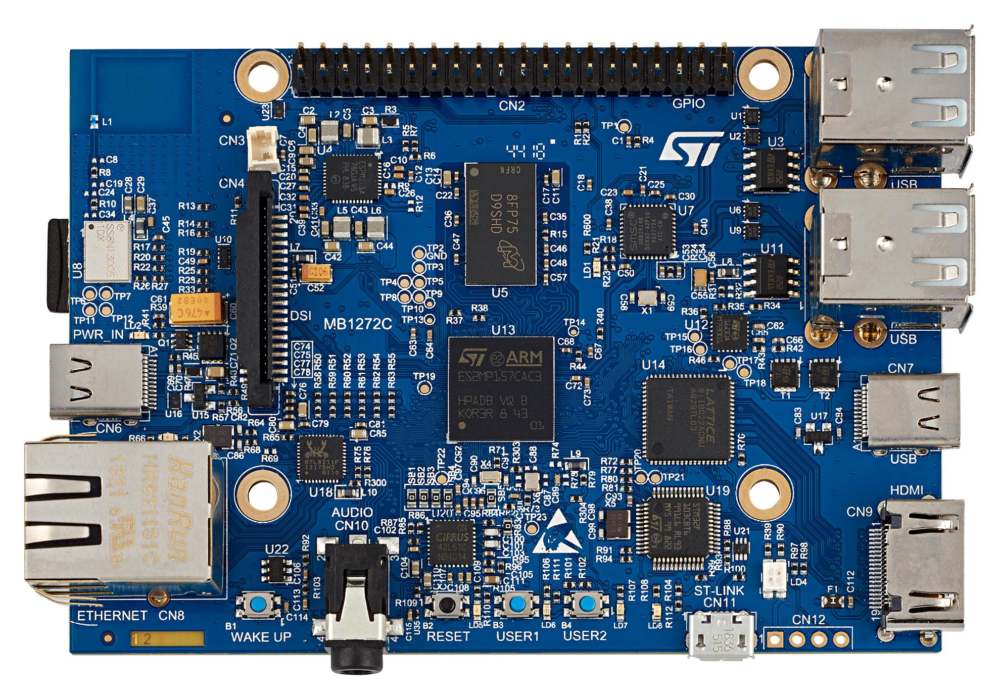

​		**X-NUCLEO-IKS01A3 sensor shield**

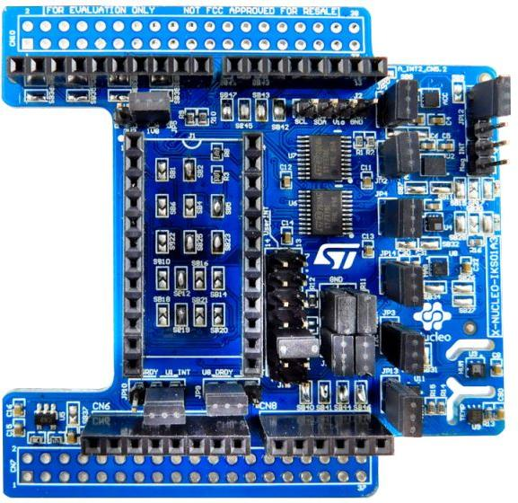

The next step is to configure the Linux software in order to let the X-NUCLEO-IKS01A3 sensor shield communicate with the STM32MP157A-DK1 board

This configuration is done by modifying the STM32MP157A-DK1 Linux kernel and managing some new device tree elements

### 1.2 Connectivity details

According to X-NUCLEO-IKS01A3 [user manual][X-NUCLEO-IKS01A3 user manual], all the sensors on the board are controlled by I2C bus

Looking at X-NUCLEO-IKS01A3 schematics in the user manual, we understand that all the I2C buses of the sensors are wired together via jumpers JP7 and JP8 and routed to Arduino connector CN5 pins 9 (SDA) and 10 (SCL)

In addition, pins 5 and 6 of Arduino connector CN9 are used to manage LSM6DSL motion MEMS interruptions (indicated for information, not used on kernel configuration)

[X-NUCLEO-IKS01A3 user manual]: https://www.st.com/resource/en/user_manual/dm00601501-getting-started-with-the-xnucleoiks01a3-motion-mems-and-environmental-sensor-expansion-board-for-stm32-nucleo-stmicroelectronics.pdf

 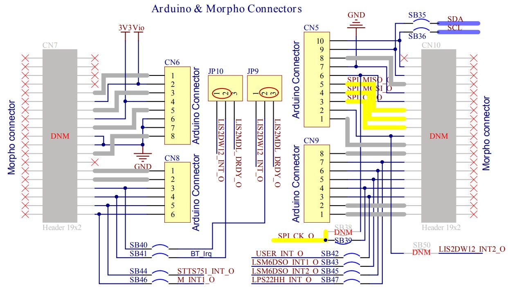

Then looking at STM32MP157Z-DK1 schematics in the [user manual][STM32MP157A-DK1 user manual], we understand that Arduino connector CN13 pins 9 (SDA) and 10 (SCL) are connected to the I2C5 of STM32MP157A

[STM32MP157A-DK1 user manual ]: https://www.st.com/content/ccc/resource/technical/layouts_and_diagrams/schematic_pack/group0/36/8e/ea/7a/ca/ca/4b/e4/mb1272-dk2-c01_schematic/files/MB1272-DK2-C01_Schematic.pdf/jcr:content/translations/en.MB1272-DK2-C01_Schematic.pdf

In addition, pins 5 and 6 of Arduino connector CN14 are used to manage LSM6DSL motion MEMS interruptions (indicated for information, not used on kernel configuration)

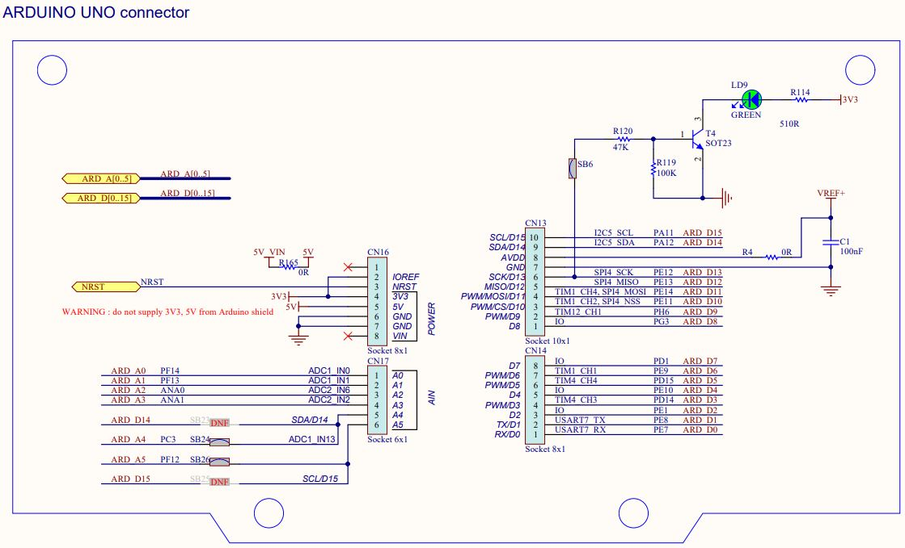


## 2. Software configuration

### 2.1 Kernel device tree configuration

The first thing to do is to verify if the I2C5 is active in the current Linux kernel we just flashed on STM32MP157A-DK1 board

> ```bash
> Board $> cat /proc/device-tree/soc/i2c@40015000/status
> ```

This command will return **disabled** so we have to enable the I2C5 into STM32MP157A-DK1 device tree and few nodes must be added for each sensor to be supported

For that, we must modify the *stm32mp157a-dk1.dts* file located in `$HOME/STM32MPU_workspace/STM32MP15-Ecosystem-v2.0.0/Developer-Package/stm32mp1-openstlinux-5-4-dunfell-mp1-20-11-12/sources/arm-ostl-linux-gnueabi/linux-stm32mp-5.4.56-r0/linux-5.4.56/arch/arm/boot/dts` directory

To edit *stm32mp157a-dk1.dts*, you can use an application like *nano* or *vi*

> ```bash
> Board $> nano $HOME/STM32MPU_workspace/STM32MP15-Ecosystem-v2.0.0/Developer-Package/stm32mp1-openstlinux-5-4-dunfell-mp1-20-11-12/sources/arm-ostl-linux-gnueabi/linux-stm32mp-5.4.56-r0/linux-5.4.56/arch/arm/boot/dts/stm32mp157a-dk1.dts
> ```

And modify as below

> ```
> &i2c5 {
> 	status = "okay";
> 
> 	hts221@5f {
> 		compatible = "st,hts221";
> 		reg = <0x5f>;
> 	};
> 	lis2dw12@19 {
> 		compatible = "st,lis2dw12";
> 		reg = <0x19>;
> 	};
> 	lis2mdl@1e {
> 		compatible = "st,lis2mdl";
> 		reg = <0x1e>;
> 	};
> };
> ```

### 2.2 Sensor configuration

By default, only the HTS221 driver (temperature sensor) present on the X-NUCLEO-IKS01A3 expansion board is enabled in the kernel configuration

To check whether associated drivers are enabled inside the kernel, type the following commands

> ```bash
> Board $> cat /proc/config.gz | gunzip | grep HTS221
> CONFIG_HTS221=y
> CONFIG_HTS221_I2C=y
> CONFIG_HTS221_SPI=y
> ```

Shows that HTS221 is enabled

But the same commands for the other sensors

> ```bash
> Board $> cat /proc/config.gz | gunzip | grep LIS2DW12
> Board $> cat /proc/config.gz | gunzip |  grep LIS2MDL
> ```

Returns nothing (or that the configuration is not set) which means that we need to patch the Linux kernel adding the missing sensor drivers

### 2.3 Patching the Linux kernel with the missing sensor drivers and enabling the sensors

1. If not done yet, the SDK environment setup script must be run once to allow further cross-compilation

> ```bash
> PC $> source $HOME/STM32MPU_workspace/STM32MP15-Ecosystem-v2.0.0/Developer-Package/SDK/environment-setup-cortexa7t2hf-neon-vfpv4-ostl-linux-gnueabi
> ```

2. Copy the folder *sensor_patches* in `$HOME/STM32MPU_workspace/STM32MP15-Ecosystem-v2.0.0/Developer-Package/stm32mp1-openstlinux-5-4-dunfell-mp1-20-11-12/sources/arm-ostl-linux-gnueabi/linux-stm32mp-5.4.56-r0` directory

> ```bash
> PC $> cp -R sensor_patches $HOME/STM32MPU_workspace/STM32MP15-Ecosystem-v2.0.0/Developer-Package/stm32mp1-openstlinux-5-4-dunfell-mp1-20-11-12/sources/arm-ostl-linux-gnueabi/linux-stm32mp-5.4.56-r0
> ```

3. Copy the folder *st* in `$HOME/STM32MPU_workspace/STM32MP15-Ecosystem-v2.0.0/Developer-Package/stm32mp1-openstlinux-5-4-dunfell-mp1-20-11-12/sources/arm-ostl-linux-gnueabi/linux-stm32mp-5.4.56-r0/linux-5.4.56/drivers/input/misc` directory

> ```bash
> PC $> cp -R st $HOME/STM32MPU_workspace/STM32MP15-Ecosystem-v2.0.0/Developer-Package/stm32mp1-openstlinux-5-4-dunfell-mp1-20-11-12/sources/arm-ostl-linux-gnueabi/linux-stm32mp-5.4.56-r0/linux-5.4.56/drivers/input/misc
> ```

4. Go to `$HOME/STM32MPU_workspace/STM32MP15-Ecosystem-v2.0.0/Developer-Package/stm32mp1-openstlinux-5-4-dunfell-mp1-20-11-12/sources/arm-ostl-linux-gnueabi/linux-stm32mp-5.4.56-r0/linux-5.4.56` directory

> ```bash
> PC $> $HOME/STM32MPU_workspace/STM32MP15-Ecosystem-v2.0.0/Developer-Package/stm32mp1-openstlinux-5-4-dunfell-mp1-20-11-12/sources/arm-ostl-linux-gnueabi/linux-stm32mp-5.4.56-r0/linux-5.4.56
> ```

5. Apply the ST patches and the sensor patches

> ```bash
> PC $> for p in `ls -1 ../*.patch`; do patch -p1 < $p; done
> PC $> for p in `ls -1 ../sensor_patches/*.patch`; do patch -p1 < $p; done
> ```

6. Create a directory where the kernel will be built

> ```bash
> PC $> mkdir -p ../build
> ```

7. Make and apply fragments

> ```bash
> PC $> make ARCH=arm multi_v7_defconfig fragment*.config O="$PWD/../build"
> PC $> for f in `ls -1 ../fragment*.config`; do scripts/kconfig/merge_config.sh -m -r -O $PWD/../build $PWD/../build/.config $f; done
> PC $> yes '' | make ARCH=arm oldconfig O="$PWD/../build"
> ```

8. In order to enable the sensors, we need to run the Linux kernel configuration with the following command

> ```bash
> PC $> make ARCH=arm menuconfig O="$PWD/../build"
> ```

- Then go to **Device Drivers > Industrial I/O support > Humidity sensors**
- Highlight **STMicroelectronics HTS221 sensor driver**, type **n**
- Do double esc to go back to **Industrial I/O support** menu
- Do double esc to go back to **Device Drivers** menu
- Go to **Device Drivers > Input device support > Miscellaneous devices**
- Highlight **STM MEMs Device Drivers (NEW)**, type **y** then enter **STM MEMs Device Drivers (NEW)**
- Highlight **accelerometer**, type **y** then enter **accelerometer**
- Highlight **STMicroelectronics LIS2DW12 sensor** then type **y**
- Do double esc to go back to **STM MEMs Device Drivers** menu
- Highlight **Humidity**, type **y** then enter **Humidity**
- Highlight **STM HTS221 sensor (NEW)** then type **y**
- Do double esc to go back to **STM MEMs Device Drivers** menu
- Highlight **magnetometer**, type **y** then enter **magnetometer**
- Highlight **STM LIS2MDL/IIS2MDC sensor** then type **y**

9. In order to use the Wi-Fi dongle later on to connect the STM32MP157A-DK1 board to a network we need to enable the related driver

- Do double esc to go back to **STM MEMs Device Drivers** menu
- Do double esc to go back to **Miscellaneous devices** menu
- Do double esc to go back to **Input device support** menu
- Do double esc to go back to **Device Drivers** menu
- Then go to **Network device support > Wireless LAN > Realtek rtlwifi family of devices**
- Highlight **Realtek RTL8192CU/RTL8188CU USB Wireless Network Adapter** then type **m**

- Do double esc many times to exit the **menuconfig** tool and choose **Yes** to save the new configuration

### 2.4 Building the Linux kernel & device tree

1. Build kernel images (uImage and vmlinux) and device tree (dtbs)

> ```bash
> PC $> make ARCH=arm uImage vmlinux dtbs LOADADDR=0xC2000040 O="$PWD/../build"
> ```

2. Build kernel modules

> ```bash
> PC $> make ARCH=arm modules O="$PWD/../build"
> ```

3. Generate output build artifacts

> ```bash
> PC $> make ARCH=arm INSTALL_MOD_PATH="$PWD/../build/install_artifact" modules_install O="$PWD/../build"
> PC $> mkdir -p $PWD/../build/install_artifact/boot/
> PC $> cp $PWD/../build/arch/arm/boot/uImage $PWD/../build/install_artifact/boot/
> PC $> cp $PWD/../build/arch/arm/boot/dts/st*.dtb $PWD/../build/install_artifact/boot/
> ```

### 2.5 Deploying the Linux kernel & device tree

There are several ways to program the generated binaries

* Update can be done over via a network interface
* Update can be done connecting the SDCard directly on the Linux host
* Update can be done connecting the SDCard on STM32MP157A-DK1 board using U-Boot <= **we will use this method**

#### 2.5.1 Enable USB mass storage mode in U-Boot

You must configure first, via U-Boot, the board into USB mass storage doing the following

1. Plug the SDCARD on Board
2. Start the board and stop on U-boot shell

> ```bash
> Hit any key to stop autoboot: 0
> STM32MP>
> ```

3. Plug an USB cable between the host PC and the STM32MP157A-DK1 board via USB OTG port (CN7)

4. On U-Boot shell, call the USB mass storage functionality

> ```bash
> STM32MP> ums 0 mmc 0
> ```

At this point you should see 4 partitions mounted on your host PC in /media/$USER/

* bootfs
* rootfs
* userfs
* vendorfs

#### 2.5.2 Copying the binaries on the bootfs

1. First go to `$HOME/STM32MPU_workspace/STM32MP15-Ecosystem-v2.0.0/Developer-Package/stm32mp1-openstlinux-20-06-24/sources/arm-ostl-linux-gnueabi/linux-stm32mp-5.4.56-r0/build/install_artifacts` directory

> ```bash
> PC $> cd $HOME/STM32MPU_workspace/STM32MP15-Ecosystem-v2.0.0/Developer-Package/stm32mp1-openstlinux-20-06-24/sources/arm-ostl-linux-gnueabi/linux-stm32mp-5.4.56-r0/build/install_artifacts
> ```

2. Copy the Linux kernel and device tree to the mounted *bootfs* partition

> ```bash
> PC $> sudo cp -rf boot/* /media/$USER/bootfs/
> ```

3. Remove the link on *install_artifact/lib/modules/5.4.56/*

> ```bash
> PC $> rm lib/modules/5.4.56/source lib/modules/5.4.56/build
> ```

4.  Optionally, strip kernel modules (to reduce the size of each kernel modules)

> ```bash
> PC $> find . -name "*.ko" | xargs $STRIP --strip-debug --remove-section=.comment --remove-section=.note --preserve-dates
> ```

5. Copy the kernel modules to the mounted *rootfs* partition

> ```bash
> PC $> sudo cp -r lib/modules/* /media/$USER/rootfs/lib/modules/
> ```

6. Since we are here, let's take the opportunity to copy as well the Wi-Fi dongle driver binary as well as the python script allowing to read the sensor data (that will be needed later on) into the *rootfs* partition

> ```bash
> PC $> sudo cp -r rtlwifi/* /media/$USER/rootfs/lib/firmware/
> PC $> sudo cp read_sensors.py /media/$USER/rootfs/home/root
> ```

8. Unmount properly the SDCard

> ```bash
> PC $> umount /media/$USER/bootfs
> PC $> umount /media/$USER/rootfs
> PC $> umount /media/$USER/userfs
> PC $> umount /media/$USER/vendorfs
> ```

9. Then finally do a CRTL-C in the terminal handling U-Boot in mass storage to exit this mode and reset the board

#### 2.5.3 Verify that the new Linux kernel and device tree can access to the sensors and read their data

After the board has successfully booted don't forget to generate a list of module dependencies  (modules.dep) and a list of symbols provided by modules (modules.symbols)

> ```bash
> board $> depmod -a
> ```

Synchronize data on disk with memory

> ```bash
> board $> sync
> ```

Reboot the board in order to take update into account

> ```bash
> board $> reboot
> ```

After the board has successfully rebooted, type the following command again

> ```bash
> board $> cat /proc/device-tree/soc/i2c@40015000/status
> ```

This time the command should return *okay*

During boot you should see the following sensors being probed

> ```bash
> [    3.360101] input: hts221 as /devices/platform/soc/40015000.i2c/i2c-1/1-005f/input/input0
> [    3.369953] input: ST LIS2DW12 Accelerometer Sensor as /devices/platform/soc/40015000.i2c/i2c-1/1-0019/input/input1
> [    3.379514] input: ST LIS2DW12 Free Fall Sensor as /devices/platform/soc/40015000.i2c/i2c-1/1-0019/input/input2
> [    3.389605] input: ST LIS2DW12 Tap Sensor as /devices/platform/soc/40015000.i2c/i2c-1/1-0019/input/input3
> [    3.399111] input: ST LIS2DW12 Double Tap Sensor as /devices/platform/soc/40015000.i2c/i2c-1/1-0019/input/input4
> [    3.409425] input: ST LIS2DW12 Wake Up Sensor as /devices/platform/soc/40015000.i2c/i2c-1/1-0019/input/input5
> [    3.421511] lis2dw12 1-0019: lis2dw12: probed
> [    3.435676] input: ST LIS2MDL Magnetometer Sensor as /devices/platform/soc/40015000.i2c/i2c-1/1-001e/input/input6
> ```

Then we need to enable the sensors in order to read the sensor data

> ```bash
> board $> echo 1 > /sys/devices/platform/soc/40015000.i2c/i2c-1/1-005f/input/input0/device/enable_device
> board $> echo 1 > /sys/devices/platform/soc/40015000.i2c/i2c-1/1-0019/input/input1/accel/enable
> board $> echo 1 > /sys/devices/platform/soc/40015000.i2c/i2c-1/1-001e/input/input6/magn/enable
> ```

Finally we can read from the accelerometer sensor using the following command

> ```bash
> board $> python read_sensor.py -d acc
> ```

From the magnetometer sensor using the following command

> ```bash
> board $> python read_sensor.py -d mag
> ```

And from the pressure sensor using the following command

> ```bash
> board $> python read_sensor.py -d hum
> ```

#### 2.5.4 Connecting the STM32MP157A-DK1 board to a Wi-Fi access point

The goal is to configure an wlan network interface via systemd-networkd configuration

All the network configurations are stored on */lib/systemd/network* or */etc/systemd/network*

Create the file dedicated to wireless interface */lib/systemd/network/51-wireless.network*

> ```bash
> Board $> echo "[Match]" > /lib/systemd/network/51-wireless.network
> Board $> echo "Name=wlan0" >> /lib/systemd/network/51-wireless.network
> Board $> echo "[Network]" >> /lib/systemd/network/51-wireless.network
> Board $> echo "DHCP=ipv4" >> /lib/systemd/network/51-wireless.network
> ```

Double check that the *51-wireless.network* file content is as follow

> ```bash
> Board $> cat /lib/systemd/network/51-wireless.network
> [Match]
> Name=wlan0
> [Network]
> DHCP=ipv4
> ```

In order to attach this wireless interface to a specific network, we need to have some information like the network SSID and password

Type the following command in order to see the list of wireless network available

> ```bash
> Board $> ifconfig wlan0 up
> Board $> iw dev wlan0 scan | grep SSID
>     SSID: NETWORK1
>     SSID: NETWORK2
> ```

Associate the wireless network to the wireless interface, here *wlan0*

> ```bash
> Board $> mkdir -p /etc/wpa_supplicant/
>       echo "ctrl_interface=/var/run/wpa_supplicant" > /etc/wpa_supplicant/wpa_supplicant-wlan0.conf
>       echo "eapol_version=1" >> /etc/wpa_supplicant/wpa_supplicant-wlan0.conf
>       echo "ap_scan=1" >> /etc/wpa_supplicant/wpa_supplicant-wlan0.conf
>       echo "fast_reauth=1" >> /etc/wpa_supplicant/wpa_supplicant-wlan0.conf
>       echo "" >> /etc/wpa_supplicant/wpa_supplicant-wlan0.conf
>       wpa_passphrase SSID_OF_NETWORK PASSWORD_OF_NETWORK >> /etc/wpa_supplicant/wpa_supplicant-wlan0.conf
> ```

Where *SSID_OF_NETWORK* *PASSWORD_OF_NETWORK* correspond to the SSID and password of wireless network

Last, in order to enable and start the wireless configuration, type the following command

> ```bash
> Board $> systemctl enable wpa_supplicant@wlan0.service
> Board $> systemctl restart systemd-networkd.service
> Board $> systemctl restart wpa_supplicant@wlan0.service
> ```

Your board should be now connected to the network and internet, you can verify with the following command

> ```bash
> Board $> ping www.google.com
> ```

